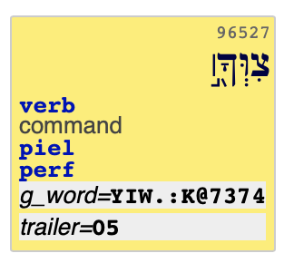
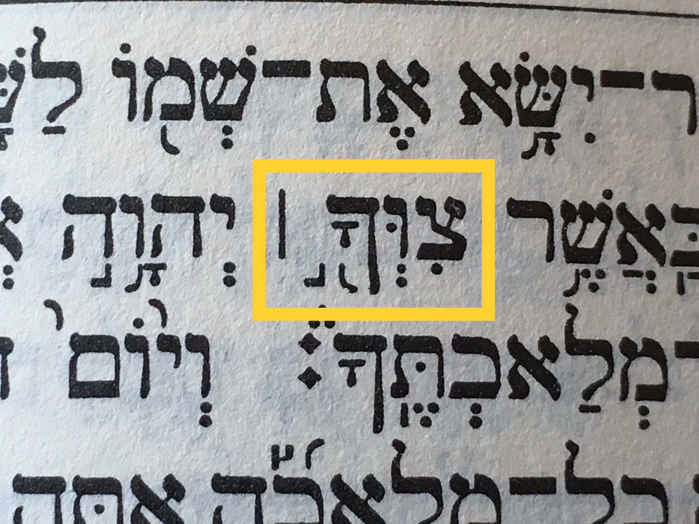

# Cantillation and accents

If you conduct an analysis of cantillation marks,
there are a few caveats.

Here is a list from several issues encountered by
Robert Voogdgeert, Cody Kingham, James Cuénod and others.


??? caution "Paseq in trailer"
    The *paseq* (`׀`, unicode `05C0`) mostly acts as punctuation,
    but may steer the interpretation of an accent in the preceding word.

    The *paseq* is always part of the `trailer` feature,
    while the preceding accent is part of the `g_word` feature.

    ???+ example "legarmeh"
        The munach may combine with the paseq and is then called a *legarmeh*.
        See Deut 5:12:

        
        

    For more cases, consult this 
    [list on wikipedia]({{cantillation}})
    or a reference work on cantillation accents. 

    The upshot is:
    **Do not overlook the *paseq*s in the `trailer` feature when
    interpreting accents.

    ??? hint "Queries"
        A query that finds potential *legarmeh*s is

        ```
        word
          g_word~74
          trailer~05
        ```

        which finds 1348 examples.
        However, not all of them count as a legarmeh.
        A much narrower query looks for munachs immediately preceding
        their paseq, i.e. without intervening (non-silent) consonants:

        ```
        word
          g_word~74[^JWBGDZXVKkLMmNnS<PpYyQR#CFT]*$
          trailer~05
         ```

        This gives only 254 results.

        The rules have a semantic component, so it is not straightforward
        to find the "true" cases in an algorithmic way.
