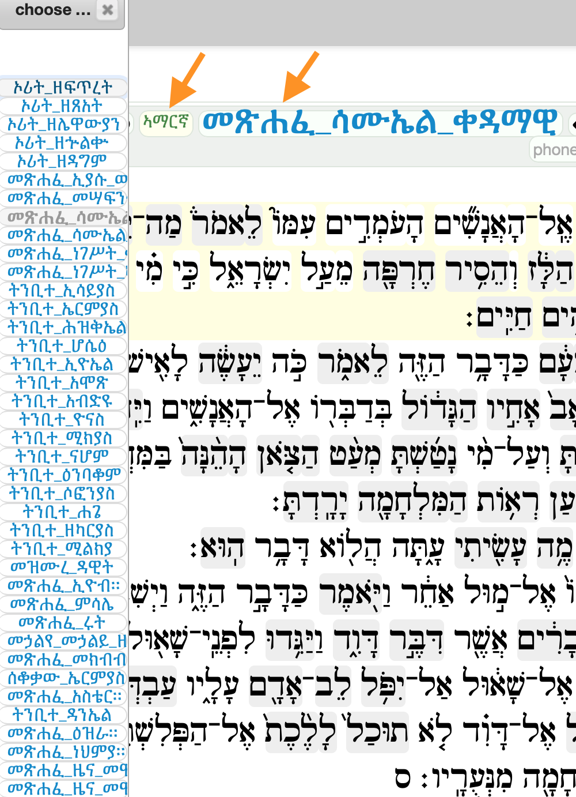

**book name (multilingual)**

This is a collection of features providing book names in multiple languages.

The book names in multiple languages are stored in features with names of the form `book@`*ll*,
where *ll* is the
[ISO 639](https://nl.wikipedia.org/wiki/ISO_639)
two-letter code for that language.

The following table shows the supported languages.

Click on the language code to see the list of Bible books in that language.
You are taken to the actual `.tf` feature data file in question.

ISO | English name | Name in the language itself
-- | --- | ---
[la](https://github.com/ETCBC/bhsa/blob/master/tf/2021/book%40la.tf) | *latin* | Latina
[en](https://github.com/ETCBC/bhsa/blob/master/tf/2021/book%40en.tf) | *english* | English
[fr](https://github.com/ETCBC/bhsa/blob/master/tf/2021/book%40fr.tf) | *french* | Français
[de](https://github.com/ETCBC/bhsa/blob/master/tf/2021/book%40de.tf) | *german* | Deutsch
[nl](https://github.com/ETCBC/bhsa/blob/master/tf/2021/book%40nl.tf) | *dutch* | Nederlands
[el](https://github.com/ETCBC/bhsa/blob/master/tf/2021/book%40el.tf) | *greek* | Ελληνικά
[he](https://github.com/ETCBC/bhsa/blob/master/tf/2021/book%40he.tf) | *hebrew* | עברית
[ru](https://github.com/ETCBC/bhsa/blob/master/tf/2021/book%40ru.tf) | *russian* | Русский
[es](https://github.com/ETCBC/bhsa/blob/master/tf/2021/book%40es.tf) | *spanish* | Español
[ko](https://github.com/ETCBC/bhsa/blob/master/tf/2021/book%40ko.tf) | *korean* | 한국어
[sw](https://github.com/ETCBC/bhsa/blob/master/tf/2021/book%40sw.tf) | *swahili* | Kiswahili
[tr](https://github.com/ETCBC/bhsa/blob/master/tf/2021/book%40tr.tf) | *turkish* | Türkçe
[id](https://github.com/ETCBC/bhsa/blob/master/tf/2021/book%40id.tf) | *indonesian* | Bahasa Indonesia
[ar](https://github.com/ETCBC/bhsa/blob/master/tf/2021/book%40ar.tf) | *arabic* | العَرَبِية
[zh](https://github.com/ETCBC/bhsa/blob/master/tf/2021/book%40zh.tf) | *chinese* | 中文
[hi](https://github.com/ETCBC/bhsa/blob/master/tf/2021/book%40hi.tf) | *hindi* | हिन्दी
[fa](https://github.com/ETCBC/bhsa/blob/master/tf/2021/book%40fa.tf) | *farsi* | فارسی
[pt](https://github.com/ETCBC/bhsa/blob/master/tf/2021/book%40pt.tf) | *portuguese* | Português
[syc](https://github.com/ETCBC/bhsa/blob/master/tf/2021/book%40syc.tf) | *syriac* | ܠܫܢܐ ܣܘܪܝܝܐ
[da](https://github.com/ETCBC/bhsa/blob/master/tf/2021/book%40da.tf) | *danish* | Dansk
[am](https://github.com/ETCBC/bhsa/blob/master/tf/2021/book%40am.tf) | *amharic* | ኣማርኛ
[bn](https://github.com/ETCBC/bhsa/blob/master/tf/2021/book%40bn.tf) | *bengali* | বাংলা
[ja](https://github.com/ETCBC/bhsa/blob/master/tf/2021/book%40ja.tf) | *japanese* | 日本語
[pa](https://github.com/ETCBC/bhsa/blob/master/tf/2021/book%40pa.tf) | *punjabi* | ਪੰਜਾਬੀ
[ur](https://github.com/ETCBC/bhsa/blob/master/tf/2021/book%40ur.tf) | *urdu* | اُردُو
[yo](https://github.com/ETCBC/bhsa/blob/master/tf/2021/book%40yo.tf) | *yoruba* | èdè Yorùbá

You can also see the list of book names of these languages in [SHEBANQ](https://shebanq.ancient-data.org).
Go to the place where you select the book. To the right you'll find the language selector.
Click on it to select a language.
The click on the book to see the list of books in that language.

##### See also

* [book](book.md)
